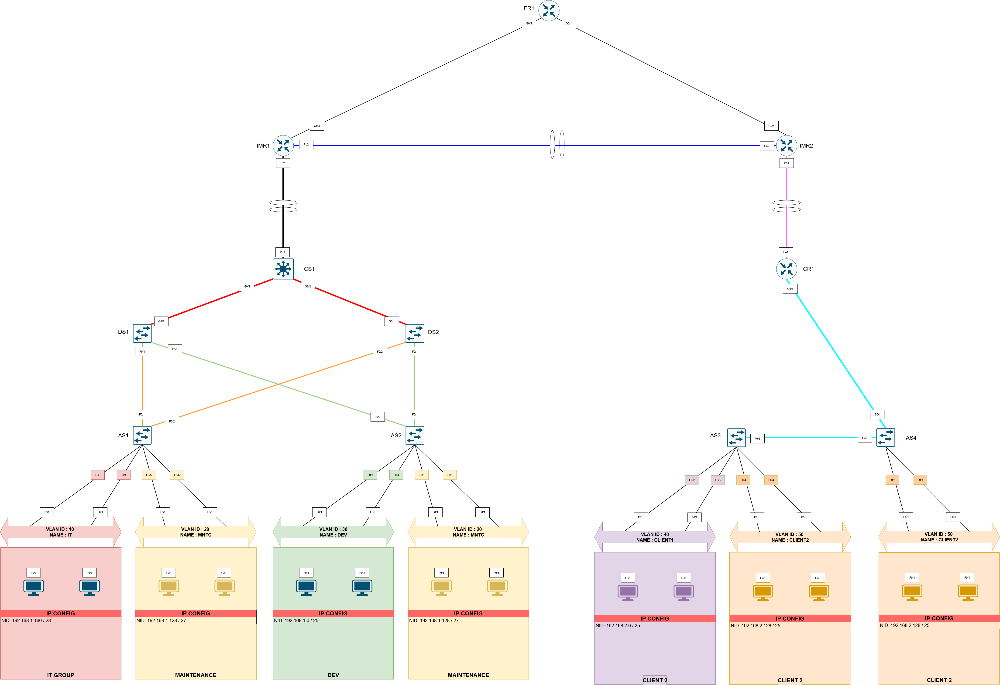

# CCNA mega Lab 1 
---
This lab was built as a part of my learning process and progress towards my CCNA journey with the resources learnt from **Jeremy IT Lab CCNA v1 (200-301) Videos Day 1 -Day24**

## Scenario 
Two branch offices of a WAN are connecting and communicating with each other i.e. (Branch 1 and Branch 2)
- (Main) Branch 1 : Hosts the *IT, Maintenance, Development * Team 
- (Clients) Branch 2 : Hosts the *Clients 1 , Clients 2*

#### Assumption
The main provides services to the two clients in a B2B connectivity, hosting X services for the clients. All of the devices connecting in a network can communicate with each other.

---
## Network Diagrams

## Abbreviations

| Abbreviation | Full Name                  |
| ------------ | -------------------------- |
| ER1          | Edge Router 1              |
| IMR1         | Internal Main Router 1     |
| IMR2         | Internal Main Router 2     |
| CS1          | Core Switch 1              |
| DS1          | Distribution Switch 1      |
| DS2          | Distribution Switch 2      |
| AS1          | Access Switch 1            |
| CR1          | Client Router 1            |
| NID          | Network ID                 |
| DG           | Default Gateway            |
| SVI          | Switched Virtual Interface |
| VLAN         | Virtual Local Area Network |

### Connections and interfaces diagram

#### Link Legend

| Color | Hex | Link Type | VLANs Carried | Description |
|-------|-----|-----------|---------------|-------------|
|  | #FF9933 | Trunk | 10, 20 | IT & MNTC — DS1/DS2 to AS1/AS2 |
|  | #97D077 | Trunk | 20, 30 | DEV & MNTC — DS1/DS2 to AS2 |
|  | #FF0000 | Trunk | 10, 20, 30 | All VLANs — CS1 to DS1/DS2 |
|  | #000000 | EtherChannel | - | CS1 to IMR1 uplink |
|  | #0000FF | EtherChannel WAN | - | IMR1 to IMR2 inter-site link |
|  | #00FFFF | Trunk | 40, 50 | CLIENT1 & CLIENT2 right branch |

#### VLAN Table

| VLAN ID | Name | Subnet | Branch | Switch |
|---------|------|--------|--------|--------|
| 10 | IT | 192.168.1.160/28 | Left | AS1 |
| 20 | MNTC | 192.168.1.128/27 | Left | AS1, AS2 |
| 30 | DEV | 192.168.1.0/25 | Left | AS2 |
| 40 | CLIENT1 | 192.168.2.0/25 | Right | AS3 |
| 50 | CLIENT2 | 192.168.2.128/25 | Right | AS3, AS4 |
### IP diagram 

